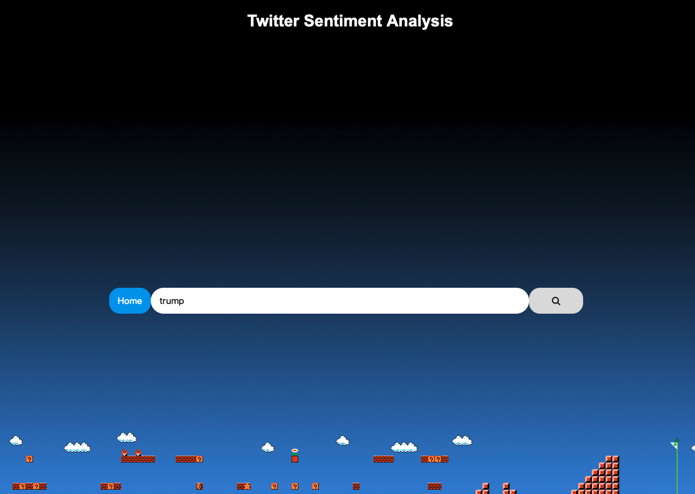

# Flask_Deployment_ML_Pipeline
This project is to familiarise with Flask and it being a panacea for deployment of ML pipelines. 

Alright, so you have figured out the mathematics behind the ML models and learn how to sklearn them. 
But now how do you get your model to the client? They are the ones to use it right ?

So the idea of the project is to give you a flavor of deploying your ML model.

The project is divided into 5 segments:
1) Model Making : The problem at hand is to determine the sentiments of tweets, whether they are hurtful or not. 
Its a classical supervised classfication problem.
2) Setting up twitter app. Here we will write twitter_api.py for extracting/scraping twitter to get tweets on the searched query.
3) WebPage : Desgining the UI. Under vien/templates/home.html.
4) Get tweets: Using the API, we are gonna recieve the tweets.
5) Predict Class and give results. :shipit:

Project demo:

1) 

2) 
